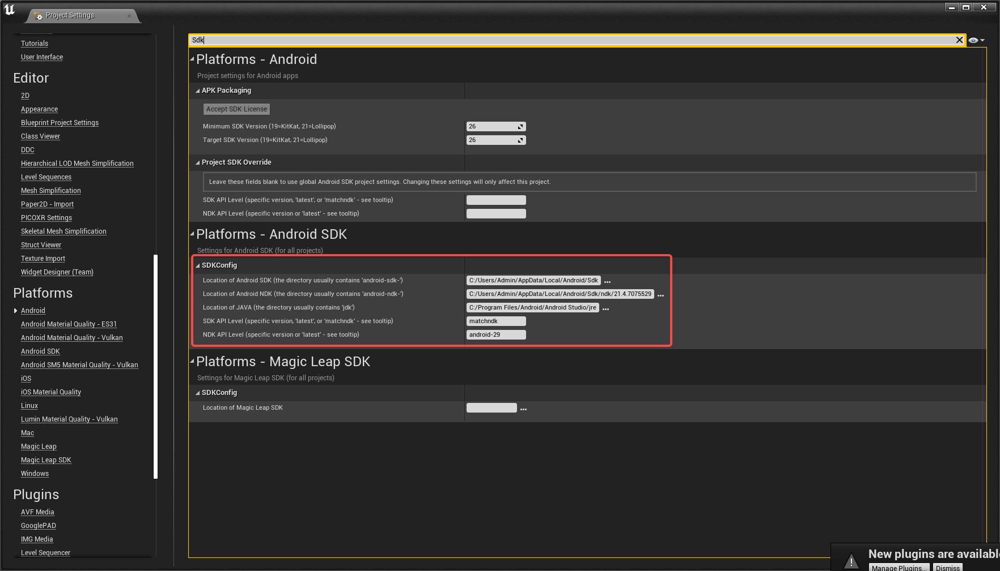

# {{project-name}}
> Put the description here!

## Table of contents
* [General Information](#general-information)
* [Setup](#setup)
* [Usage](#usage)
* [Contact](#contact)

## General Information
Put a more general information about your project

## Setup


## Usage

## Contact
{{authors}}

## How to use this template?

```
cargo generate --git https://github.com/DuinoDu/UnrealPicoTemplate --name HelloPico --force
cd HelloPico
cp <PICO_SDK_PATH>/UE_4.27/Plugins .
"Open UE4.27 to build an android project." 
```
Config Android Sdk if you first build unreal android project.

